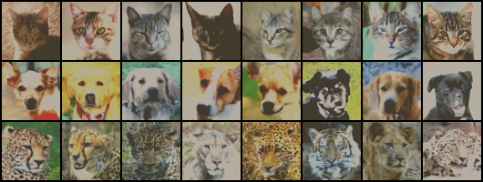

# From-DDPM-to-Stable-Diffusion

## VAE

1. https://github.com/AntixK/PyTorch-VAE

## Tiny SD

1. 尝试自己训练一个小型的Stable Diffusion，硬件只有一张16GB的RTX-4080。
2. 数据集使用animal-faces，详见：https://www.kaggle.com/datasets/andrewmvd/animal-faces
   1. 
3. 方法1: 将所有512\*512的图片转成64\*64，然后在图片空间直接训练，重新生成图片如下
   1. 
4. DDPM 代码可参考：
   1. https://github.com/hkproj/pytorch-ddpm/tree/main
   2. https://github.com/zoubohao/DenoisingDiffusionProbabilityModel-ddpm-
   3. https://github.com/abarankab/DDPM/tree/main

## Stable Diffusion 1

1. Stable Diffusion 1 架构示意图如下：
   1. 
2. inference代码可参考：
   1. https://github.com/kjsman/stable-diffusion-pytorch
   2. https://github.com/hkproj/pytorch-stable-diffusion

## Stable Diffusion 3

1. Stable Diffusion 3 架构示意图如下：
   1. 
2. inference代码可参考：
   1. https://github.com/Stability-AI/sd3-ref
   2. https://github.com/huggingface/diffusers/blob/main/src/diffusers/pipelines/stable_diffusion_3/pipeline_stable_diffusion_3.py#L131
