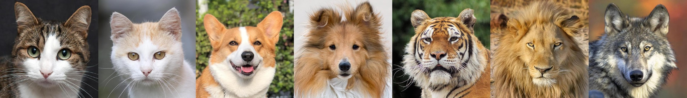
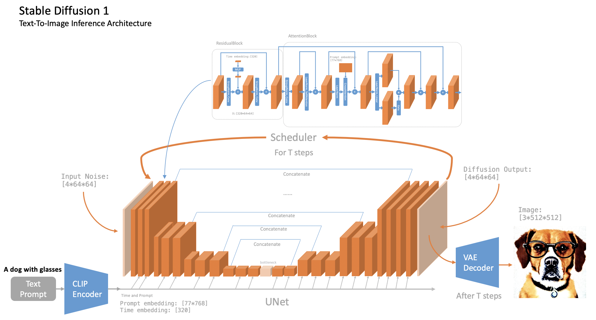

# From-DDPM-to-Stable-Diffusion

## Data and Model Weights

1. The training data for the following experiments all
   use [animal-faces](https://www.kaggle.com/datasets/andrewmvd/animal-faces).
    1. 
2. Download stable diffusion 1 weights
   from [here](https://huggingface.co/jinseokim/stable-diffusion-pytorch-data/resolve/main/data.v20221029.tar).
3. Download stable diffusion 3 weights
   from [stable-diffusion-3-medium](https://huggingface.co/stabilityai/stable-diffusion-3-medium)
4. Your folders should be like this:
   ```plaintext
   project-root/
   ├── 00_assets/
   │       ├── datasets/
   │       │   └── afhq/
   │       │       ├── train/
   │       │       └── val/
   │       ├── model_sd1/
   │       │   ├── ckpt/
   │       │   │   └── ...
   │       │   ├── merges.txt
   │       │   └── vocab.json
   │       ├── model_sd3/
   │       │   ├── clip_g.safetensors
   │       │   └── ...
   │       └── image/
   ├── 01_stable_diffusion-1/
   ├── ...
   ```

## Stable Diffusion 1

1. Refer to the inference code of Stable Diffusion 1 to familiarize yourself with the model structure. The architecture
   diagram is as follows:
    1. 
2. References:
    1. https://github.com/kjsman/stable-diffusion-pytorch
    2. https://github.com/hkproj/pytorch-stable-diffusion

## Stable Diffusion 3

1. Refer to the inference code of Stable Diffusion 3 to be familiar with the model structure. The architecture diagram
   is as follows:
    1. 
2. References:
    1. https://github.com/Stability-AI/sd3-ref
    2. https://github.com/huggingface/diffusers/blob/main/src/diffusers/pipelines/stable_diffusion_3/pipeline_stable_diffusion_3.py#L131

## VAE

1. The architecture diagram of VQ-VAE is as follows:
    1. 
2. The results of VQ-VAE are shown below. The first row is the original images, and the second row is the
   reconstructed images.
    1. 
3. The results of [sdxl-vae](https://huggingface.co/stabilityai/sdxl-vae) are shown below.
    1. 
4. References:
    1. https://github.com/AntixK/PyTorch-VAE
    2. https://github.com/CompVis/latent-diffusion/blob/main/ldm/models/autoencoder.py

## Vision Transformer

1. ViT (Vision Transformer) is a model that applies the Transformer architecture to computer vision tasks. Unlike
   traditional Convolutional Neural Networks (CNNs), ViT directly divides an image into fixed-size patches and flattens
   them into sequences, similar to word embeddings in natural language processing.
2. 
3. References:
    1. https://github.com/lucidrains/vit-pytorch

## CLIP

1. CLIP (Contrastive Language-Image Pretraining) is a multimodal model trained on a large dataset of image-text pairs
   using contrastive learning. The model's goal is to minimize the distance between matching pairs and maximize the
   distance between non-matching pairs, enabling it to associate images with their corresponding descriptive texts
   within the same semantic space. CLIP is composed of two main components: a Transformer Encoder for text and a Vision
   Transformer for images.
2. SigLIP is CLIP, a multimodal model, with a better loss function. The sigmoid loss operates solely on image-text pairs
   and does not require a global view of the pairwise similarities for normalization. This allows further scaling up the
   batch size, while also performing better at smaller batch sizes.
3. References:
    1. https://github.com/openai/CLIP
    2. https://huggingface.co/google/siglip-so400m-patch14-384

## DDPM

1. During the encoding process, noise is gradually added to the image, and after T steps, the image is completely
   transformed into random noise. This process does not involve parameter learning; instead, the original image is
   input, and the image at step t is computed using predetermined coefficients. The decoding process mainly involves
   noise removal with UNet model, where noise is progressively reduced until the desired image is generated.
    1. 
2. References:
    1. https://github.com/zoubohao/DenoisingDiffusionProbabilityModel-ddpm-

## Tiny Stable Diffusion

1. Attempt to train a small-scale Stable Diffusion model on hardware with only one 16GB RTX-4080 GPU.
2. Method 1: Downscale all 512x512 images to 64x64 and train directly in the image space. The regenerated images are
   shown below. While the results are not perfect, at least dogs look like dogs and cats look like cats.
    1. 
3. Method 2: Convert the images to the latent space using VQVAE. Since the code is basically the same as in Method 1, I
   did not rerun it.

## Multimodal

1. PaliGemma: PaliGemma is the composition of a Transformer decoder and a Vision Transformer image encoder, with a total
   of 3 billion params. The text decoder is initialized from Gemma-2B. The image encoder is initialized from
   SigLIP-So400m/14. PaliGemma is trained following the PaLI-3 recipes. The model architecture is also very simple; it
   just involves concatenation.
    1. 
2. MiniCPM: MiniCPM-V 2.6 is the latest and most capable model in the MiniCPM-V series. The model is built on
   SigLip-400M and Qwen2-7B with a total of 8B parameters.
3. References:
    1. https://openai.com/index/gpt-4v-system-card/
    2. https://www.youtube.com/watch?v=vAmKB7iPkWw
    3. https://github.com/hkproj/pytorch-paligemma
    4. https://huggingface.co/google/paligemma-3b-pt-224
    5. https://huggingface.co/blog/zh/paligemma
    6. https://huggingface.co/openbmb/MiniCPM-V-2_6
