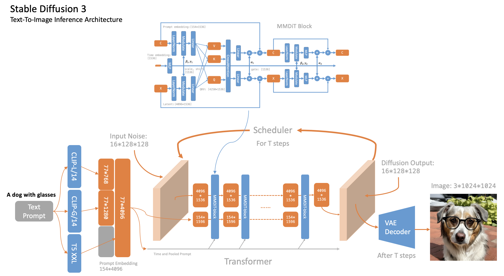

# From-DDPM-to-Stable-Diffusion

## Data

1. The training data for the following experiments all use [animal-faces](https://www.kaggle.com/datasets/andrewmvd/animal-faces).
    1. 

# Inference

## Stable Diffusion 1

1. Refer to the inference code of Stable Diffusion 1 to familiarize yourself with the model structure. The architecture diagram is as follows:
    1. 
2. References:
    1. https://github.com/kjsman/stable-diffusion-pytorch
    2. https://github.com/hkproj/pytorch-stable-diffusion

## Stable Diffusion 3

1. Refer to the inference code of Stable Diffusion 3 to be familiar with the model structure. The architecture diagram is as follows:
    1. 
2. References:
    1. https://github.com/Stability-AI/sd3-ref
    2. https://github.com/huggingface/diffusers/blob/main/src/diffusers/pipelines/stable_diffusion_3/pipeline_stable_diffusion_3.py#L131

# Train

## VAE

1. Explore various VAE variants and train a VQVAE using the animal-faces dataset.
   1. https://github.com/CompVis/latent-diffusion/blob/main/ldm/models/autoencoder.py
2. References:
   1. https://github.com/AntixK/PyTorch-VAE
   2. https://github.com/CompVis/latent-diffusion/blob/main/ldm/models/autoencoder.py

## Tiny Stable Diffusion

1. Attempt to train a small-scale Stable Diffusion model on hardware with only one 16GB RTX-4080 GPU.
2. Method 1: Downscale all 512x512 images to 64x64 and train directly in the image space. The regenerated images are shown below. While the results are not perfect, at least dogs look like dogs and cats look like cats.
    1. 
3. Method 2: Convert the images to the latent space using sdxl-vae before training. The results of sdxl-vae are shown below. The training code is essentially the same as Method 1, so it won’t be rerun.
   1. 
   2. 
4. Method 3: First train a VAE on the animal-faces dataset, then convert the images to the latent space using this VAE before training.
5.	DDPM code references:
    1. https://github.com/hkproj/pytorch-ddpm/tree/main
    2. https://github.com/zoubohao/DenoisingDiffusionProbabilityModel-ddpm-
    3. https://github.com/abarankab/DDPM/tree/main

## Multimodal

1. https://www.youtube.com/watch?v=vAmKB7iPkWw
2. https://github.com/hkproj/pytorch-paligemma
3. https://huggingface.co/openbmb
4. https://openai.com/index/gpt-4v-system-card/
5. https://huggingface.co/google/paligemma-3b-pt-224